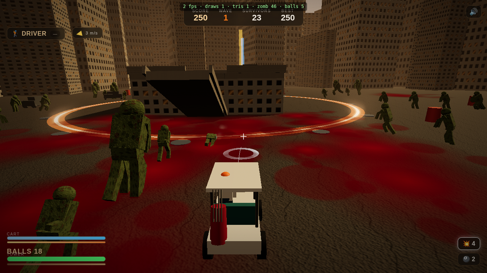

# GOLF Z ⛳🧟 — Zombie Golf

A 3D zombie-golf survival game for the browser. You're stranded on a rooftop in a dead city.
**Charge a power swing and drive golf balls into the horde**, **gun the golf cart down a ramp
to the street and run them over**, **rescue trapped survivors and put them on the perimeter as
turrets and barricades**, and **set off chained explosions** — all while holding your tower
against escalating waves.

Real-time 3D (Three.js) with realistic spin-based ball physics, **articulated ragdoll zombies
with gore and dismemberment**, a drivable cart with boost and run-over carnage, a tower-defense
survivor layer, explosive chain reactions, bloom, screenshake and hit-stop. Runs on desktop,
mobile and gamepad.



## Run it

100% static — no build step, no install. Serve the `public/` folder over HTTP (ES modules
don't load from `file://`):

```bash
python3 -m http.server 8000 --directory public      # → http://localhost:8000
# or:  npm start   |   npx serve public
```

Open the URL, click **PLAY**, and hold the line.

## Controls

| Action | Desktop | Touch | Gamepad |
|---|---|---|---|
| Aim | Mouse | Drag right side | Right stick |
| Charge & fire | Hold **Left-Click** / **Space**, release | Hold **SWING** | **RT** |
| Drive the cart | **W A S D** | Left pad | Left stick |
| **Boost** | **Shift** | **BOOST** | **LT** |
| **Change club** | **C** | **CLUB** | **LB** |
| **Spin** (back/top) | **V** | **SPIN** | **D-pad ↑** |
| Cycle power-up | **Q** | **ITEM** | — |
| **Build mode** (survivors) | **B** / **Tab** | **BUILD** | **Y** |
| Place / cycle / sell | **Enter** / **`[ ]`** / **X** | menu chips | **A** / bumpers / **B** |
| Back to roof | **R** | — | **D-pad ↓** |
| Pause / mute | **P** / **Esc** · **M** | — | **Start** |

The **power meter** ping-pongs 0→100→0 while charging — release on the beat. The white arc +
ground ring previews exactly where the ball lands (it simulates spin and wind).

## How it plays

- Zombies (shamblers, fast **runners**, tanky **brutes**) pour in and stop at the glowing
  **defense perimeter** to tear at your tower. Drop the **TOWER** bar to zero and it's over.
- **Golf them**: three clubs (Driver / 9-Iron / Wedge) with real **spin** — backspin grabs and
  hops back, topspin runs out, a release-flick adds side-curve; **wind** bends every shot.
  A fast ball plows through several zombies and can tear off limbs.
- **Drive & ram**: take the ramp down to the street and **run zombies over** — boost for bigger
  launches. The street is risky: zombies claw your **CART** bar.
- **Blow stuff up**: explosive barrels and abandoned cars **chain-react** — kick one off near a
  cluster and watch the lane go up. Explosive-ball pickups do the same.
- **Rescue & defend**: free caged **survivors** (clear the zombies near them, smack the cage with
  a ball, or drive over) — they sprint home and become currency. Spend them in **build mode** to
  staff perimeter posts with **turrets** (auto-fire), **spotters** (slow clusters) and
  **barricades** (block & slow the horde). Tower defense + golf + carnage.
- Power-ups: 💥 explosive balls, 🎱 multi-ball, ⛳ ammo, ➕ tower repair. Surge waves every few
  rounds. Score, combos and your best wave are saved locally.

## A note on the visuals

The original brief asked for "very realistic 3D". This was built where the AI asset generator
(photoreal textures / 3D meshes / audio) and the one-click hosted deploy were **out of credits**,
so everything is generated **procedurally in code** — canvas textures with normal maps, cinematic
golden-hour lighting, fog, **UnrealBloom**, film grain, and synthesized Web Audio. Characters are
articulated low-poly bodies (with ragdoll physics + dismemberment) rather than sculpted photoreal
meshes — gritty-grounded, not Hollywood-CGI. With credits topped up the same game can be re-skinned
with AI textures and published to a shareable URL.

## Tech notes

- **Three.js** vendored in `public/vendor/` (engine + post-processing addons; no CDN, works offline).
- **Fixed-timestep** 60 Hz sim decoupled from render; hit-stop scales the accumulator so impacts
  freeze the whole world for a beat. Seeded RNG for spawn/placement determinism.
- **Draw-call discipline**: the whole articulated horde is **11 instanced body-part meshes + 1
  debris mesh**; gore, props, survivors and particles are all instanced/pooled. `?dev=1` shows an
  FPS / draw-call / entity overlay.
- **Zero per-frame allocation** in the hot loops (reused scratch vectors/matrices, ring-buffer pools).
- **Bloom** via EffectComposer (RenderPass → UnrealBloom → OutputPass); a high luminance threshold
  keeps the diffuse scene grounded while emissive/additive heroes glow.
- All player-visible text in `public/strings.js`; physical key codes throughout; touch + gamepad
  first-class. `logic.js` is the engine-compat stub — all simulation is client-side.

## Project layout

```
public/
  index.html            # canvas, HUD/screens, film-grain overlay, import map
  strings.js  logic.js  vendor/{three.module.js, three-addons/…}
  js/
    config.js    # every tunable number
    main.js      # bootstrap, Game state machine, fixed-timestep loop, composer render
    world.js     # sky, golden-hour lighting, fog, tower, rooftop, ramp, perimeter, city
    player.js    # drivable cart + golfer (boost, drift, surface-follow, run-over)
    golf.js      # spin/Magnus ball physics, clubs, wind, trajectory, chase camera
    zombies.js   # articulated instanced horde, FK anim, ragdoll, dismemberment, 3 types
    survivors.js # rescue + tower-defense (turrets / spotters / barricades / economy)
    props.js     # explosive barrels & cars with chain reactions
    gore.js      # blood particles + persistent decals + meat chunks
    effects.js   # pooled particles, fireballs, shock rings, muzzle, debris
    postfx.js    # EffectComposer bloom + camera trauma (shake) + hit-stop
    audio.js  input.js  hud.js  utils.js  textures.js
design/                 # plan, per-subsystem specs, asset manifest, thresholds, review
tools/verify.mjs        # headless smoke test (drives the sim, asserts, screenshots)
```

## Tuning & dev

All balance lives in [`public/js/config.js`](public/js/config.js) (documented in
[`design/thresholds.md`](design/thresholds.md)). `npm run verify` loads the game in headless
Chromium, drives the fixed-step sim through every system (zombies, golf physics, gore, run-over,
chain reactions, rescue, turrets, barricades), asserts behavior, checks for console errors, and
writes `tools/shot_game.png` / `tools/shot_drive.png`.
