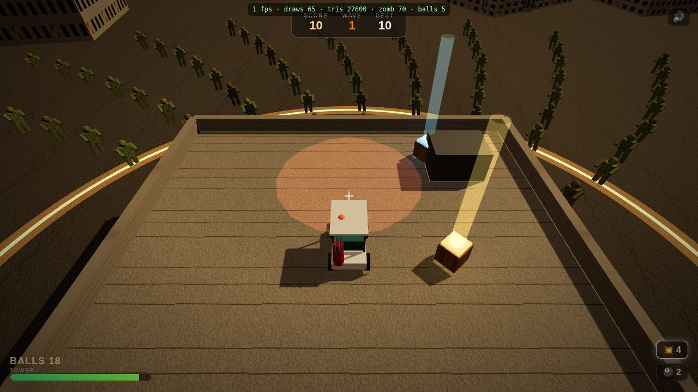

# GOLF Z ⛳🧟 — Zombie Golf

A 3D zombie-golf survival game for the browser. You're stranded on a rooftop in a
dead city. **Charge a power swing and drive golf balls into the horde** flooding the
streets below, **drive a golf cart** to reposition and grab supply crates, and hold
your defense perimeter wave after wave.

Real-time 3D (Three.js), realistic golf-ball physics with a live trajectory preview,
escalating waves, scoring & combos, and power-ups — explosive balls, multi-ball
spread shots, ammo resupply and tower-repair packs. Runs on desktop, mobile and with
a gamepad.



## Run it

The game is 100% static — no build step, no install needed. Just serve the `public/`
folder over HTTP (ES modules don't load from `file://`):

```bash
# any one of these, then open the printed URL
python3 -m http.server 8000 --directory public      # → http://localhost:8000
# or
npm start                                            # same thing
# or
npx serve public
```

Open the URL, click **PLAY**, and defend the rooftop.

## Controls

| Action | Desktop | Touch | Gamepad |
|---|---|---|---|
| Aim | Mouse | Drag right side | Right stick |
| Charge & fire | Hold **Left-Click** / **Space**, release | Hold **SWING**, release | **RT**, release |
| Drive the cart | **W A S D** | Left pad | Left stick |
| Cycle power-up | **Q** | **ITEM** | **A** |
| Pause / mute | **P** / **Esc** · **M** | — | **Start** |

The **power meter** ping-pongs 0→100→0 while you charge — release at the right moment
for the distance you want. The white arc + ground ring shows where the ball will land.

## How it plays

- Zombies spawn around you and shamble toward the glowing **defense perimeter**. If they
  reach it they start tearing at your tower (the **TOWER** bar). Drop it to zero and it's over.
- A **direct hit** kills a zombie — a fast ball can plow through several.
- Pick up crates by driving the cart over them:
  - 💥 **Explosive balls** — area blast, great for clusters at the perimeter.
  - 🎱 **Multi-ball** — a fan of five balls in one swing.
  - ⛳ **Ammo** — refills your golf balls.
  - ➕ **Health** — repairs the tower.
- Press the item key to **arm** explosive/multi-ball so you can save them for the right moment.
- Every few waves is a **surge** — more zombies, faster. Score racks up per kill, with
  combo bonuses for multi-kills. Your best wave is saved locally.

## A note on the visuals

The brief asked for "very realistic 3D". This build was made in an environment where the
AI asset generator (photoreal textures, 3D meshes, audio) and the one-click hosted deploy
**ran out of credits**, so everything here is generated **procedurally in code** instead —
canvas textures with real normal maps, cinematic golden-hour lighting, fog and a film-grain
overlay, plus synthesized Web Audio. It's the honest "grounded realism" version: real 3D
geometry dressed in procedural materials rather than sculpted photoreal meshes. With credits
topped up, the same game can be re-skinned with AI textures and published to a shareable URL.

## Tech notes

- **Three.js** is vendored in `public/vendor/` (no CDN dependency, works offline).
- **Fixed-timestep** simulation (60 Hz) decoupled from rendering; seeded RNG for spawns.
- The entire horde (up to 70 zombies) is a single **`InstancedMesh` — one draw call**;
  pooled particles are another. `?dev=1` shows an FPS / draw-call / entity overlay.
- All player-visible text lives in `public/strings.js`; physical key codes throughout, so
  it works on non-Latin keyboard layouts. Touch and gamepad are first-class.
- `logic.js` is the engine-compatibility stub — all real simulation is client-side.

## Project layout

```
public/                 # the game (this is the web root / what would be deployed)
  index.html            # canvas, HUD/screens, film-grain overlay, import map
  strings.js            # all UI text
  logic.js              # solo engine stub
  vendor/three.module.js
  js/
    config.js           # every tunable number lives here
    main.js             # bootstrap, Game state machine, fixed-timestep loop
    world.js            # sky, lighting, fog, rooftop, perimeter, instanced city
    player.js           # drivable cart + golfer
    golf.js             # aim, power meter, ball physics, trajectory, camera
    zombies.js          # instanced horde (one draw call), waves, AI, hits
    powerups.js         # supply crates
    effects.js          # pooled particles, explosions, shock rings
    textures.js         # procedural canvas textures + normal maps
    audio.js            # synthesized Web Audio SFX + ambient
    input.js            # keyboard / mouse+pointerlock / touch / gamepad
    hud.js              # DOM HUD + screens
    utils.js
design/                 # plan + asset manifest + tuned thresholds
tools/verify.mjs        # headless smoke test (drives the sim, screenshots)
```

## Tuning

All balance numbers are in [`public/js/config.js`](public/js/config.js) (and documented in
[`design/thresholds.md`](design/thresholds.md)) — wave sizes, speeds, launch power, gravity,
damage, power-up amounts, camera. Change one number at a time.

## Dev / verification

`npm run verify` loads the game in headless Chromium, drives the fixed-step simulation
(spawns a wave, fires balls, tests collisions/scoring, forces a full horde to confirm the
one-draw-call budget), checks for console errors and writes `tools/shot_menu.png` /
`tools/shot_game.png`.
